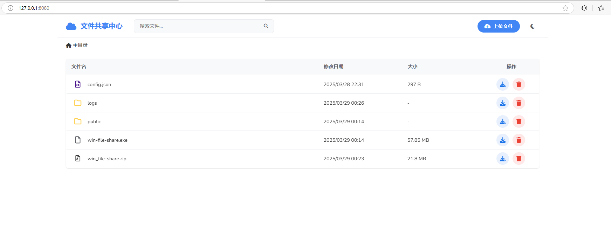

# 文件共享中心 (File Sharing System)

一个基于 Express.js 的文件共享应用，提供简洁美观的用户界面和丰富的文件管理功能。个人使用不错。

UI界面：



## 功能特点

- 文件上传（支持单个/多个文件上传）
- 文件预览（支持图片、PDF、文本等常用格式）
- 文件/文件夹管理（删除、重命名、移动）
- 拖放支持（拖放上传、拖拽移动）
- 响应式设计（适配桌面端、平板端和移动端）
- 暗色主题支持

## 技术栈

- 后端：Express.js, Node.js
- 前端：Vanilla JavaScript, CSS3, HTML5
- 存储：本地文件系统

## 安装与使用

### 开发环境

1. 克隆仓库：
```
git clone <repository-url>
```

2. 安装依赖：
```
npm install
```

3. 配置 `config.json`（可选）：
```json
{
  "sharePath": "./shared",
  "port": 8080,
  "maxFileSize": 100000000,
  "maxPreviewSize": 5242880,
  "permissions": {
    "upload": true,
    "delete": true,
    "download": true,
    "rename": true,
    "createFolder": true,
    "move": true,
    "dragAndDrop": true,
    "preview": true
  }
}
```

4. 启动服务器：
```
npm start
```

### 打包与部署

本应用支持使用 `pkg` 打包成独立的可执行文件，便于在无需安装 Node.js 环境的服务器上部署。

#### 打包步骤

1. 构建应用：
```
npm run build
```
这将在 `dist` 目录下创建 Windows 和 Linux 平台的可执行文件。

2. 复制静态资源：
```
.\copy-assets.bat
```
这将复制 `public` 目录和 `config.json` 到可执行文件所在的目录。

#### 部署说明

1. 将生成的可执行文件（`dist/win/file-share.exe` 或 `dist/linux/file-share`）及其同目录下的 `public` 文件夹和 `config.json` 一起复制到目标服务器。

2. 运行可执行文件：
   - Windows: `.\file-share.exe [选项]`
   - Linux: `./file-share [选项]`

#### 命令行选项

可执行文件支持以下命令行选项，用于覆盖 `config.json` 中的设置：

- `--port <端口号>`: 指定服务器监听的端口（默认：80）
- `--sharePath <路径>`: 指定共享文件的存储路径
- `--maxFileSize <大小>`: 指定上传文件的最大大小（字节）

示例：
```
.\file-share.exe --port 8080 --sharePath D:\shared_files
```

## 注意事项

1. 确保 `public` 目录和 `config.json` 文件与可执行文件位于同一目录下。
2. 在 Linux 上，可能需要为可执行文件添加执行权限：`chmod +x file-share`
3. 在某些系统上，使用 80 端口可能需要管理员/root 权限。

## 配置说明

可以通过编辑 `config.json` 文件来调整应用配置：

- `sharePath`: 共享文件存储位置
- `maxFileSize`: 允许上传的最大文件大小（字节）
- `permissions`: 权限控制开关
- `excludedFiles`: 不显示的文件/文件夹列表
- `allowedFileTypes`: 允许上传的文件类型
- `thumbnailSize`: 缩略图大小设置
- `cacheDuration`: 缓存持续时间（秒）

## 使用许可

MIT 